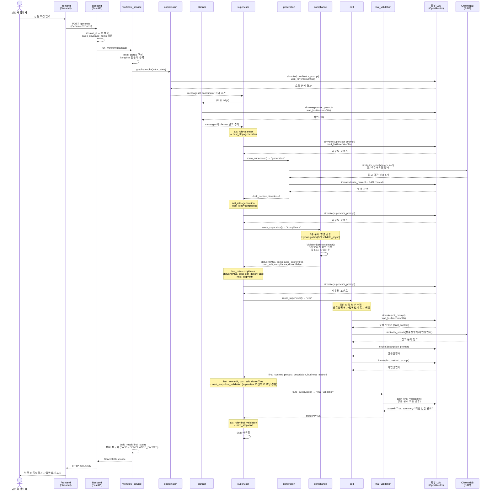
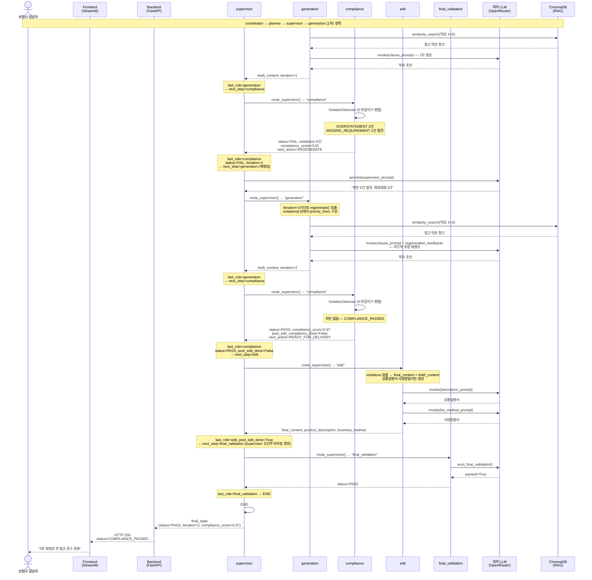
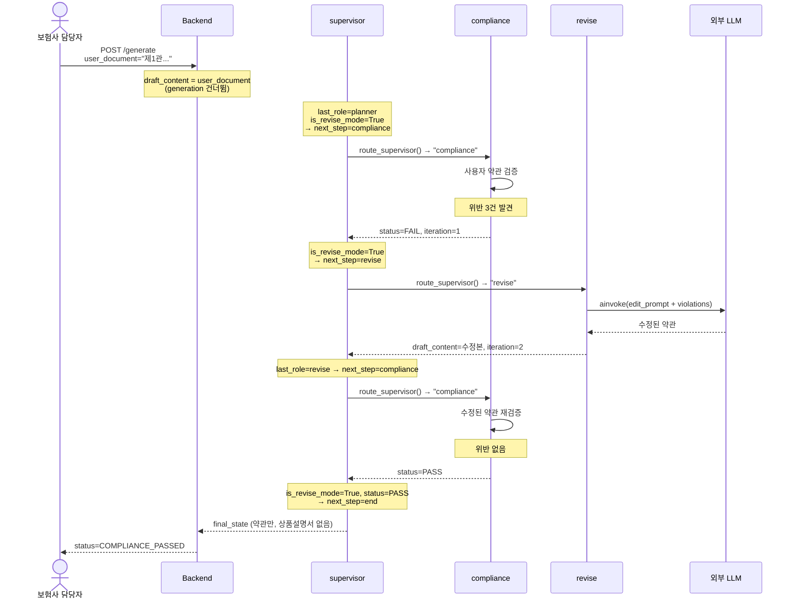

# 시퀀스 다이어그램

**시스템명**: PoCat — 실손의료보험 약관 자동 생성 시스템  
**버전**: 2.0.0  
**작성일**: 2026-06-20  
**소스**: `backend/src/graph/nodes.py`, `backend/src/graph/builder.py`, `backend/src/service/workflow_service.py`

---

## 1. 정상 흐름 (Compliance PASS)

약관 초안이 1회 생성 후 법규 검증을 통과하여 최종 3종 문서가 완성되는 시나리오.

---

## 2. 재생성 흐름 (Compliance FAIL → 재생성 → PASS)

약관 초안이 법규 검증에서 실패하여 위반 피드백을 반영해 재생성한 후 통과하는 시나리오.

---

## 3. 사용자 작성 약관 검증·수정 흐름

`user_document` 필드 제공 시 generation 생략, compliance → revise 반복 모드.

