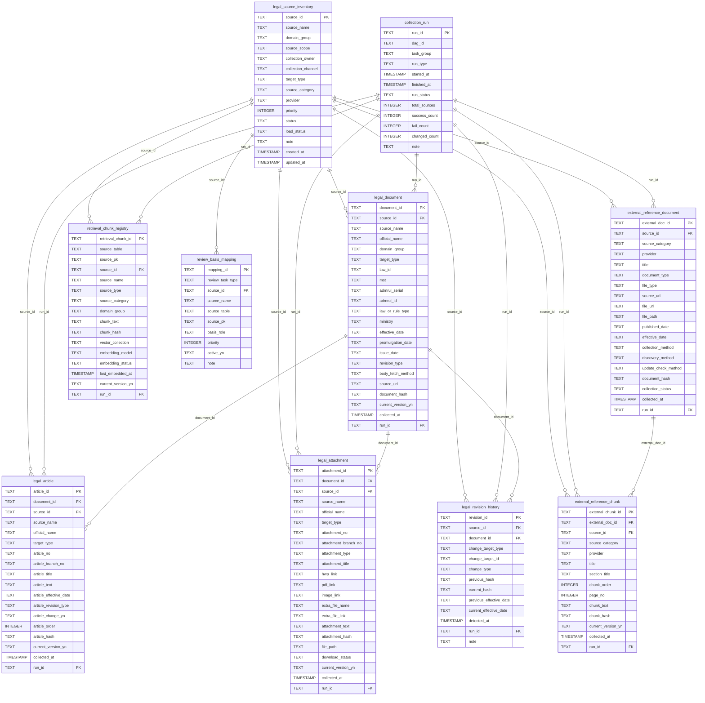

# ERD (Entity-Relationship Diagram)

**시스템명**: PoCat — 법률 데이터 파이프라인 DB  
**버전**: 2.0.0  
**작성일**: 2026-06-20  
**소스**: `legal-data-pipeline/src/create_schema.py`

---

## 1. 테이블 목록

| 테이블명 | 역할 |
|----------|------|
| `legal_source_inventory` | 수집 대상 법령·규정 출처 목록 (마스터) |
| `collection_run` | 수집 파이프라인 실행 이력 |
| `legal_document` | 수집된 법령·감독규정 문서 원본 |
| `legal_article` | 법령 조문 단위 (문서의 하위 엔티티) |
| `legal_attachment` | 법령 별표·서식 등 첨부파일 |
| `external_reference_document` | 외부 참고 문서 (보험업감독규정, 가이드라인 등) |
| `external_reference_chunk` | 외부 참고 문서의 청크 단위 텍스트 |
| `legal_revision_history` | 법령 개정 이력 (변경 감지 로그) |
| `retrieval_chunk_registry` | RAG 임베딩 대상 청크 레지스트리 |
| `review_basis_mapping` | 검토 작업 유형별 검토 근거 매핑 |

---

## 2. ERD (Mermaid)

---

## 3. 관계 설명

### 3.1 핵심 참조 관계

| 관계 | 카디널리티 | 설명 |
|------|-----------|------|
| `legal_source_inventory` → `legal_document` | 1:N | 하나의 출처에서 여러 법령 문서 수집 |
| `legal_document` → `legal_article` | 1:N | 하나의 법령 문서는 여러 조문으로 구성 |
| `legal_document` → `legal_attachment` | 1:N | 법령에 여러 별표·서식 첨부 가능 |
| `legal_document` → `legal_revision_history` | 1:N | 법령 개정 시마다 이력 기록 |
| `external_reference_document` → `external_reference_chunk` | 1:N | 외부 참고 문서는 청크로 분할 저장 |
| `collection_run` → (모든 문서/조문/청크 테이블) | 1:N | 각 수집 실행 시 생성된 레코드 추적 |

### 3.2 `legal_source_inventory`의 역할

모든 실질 데이터 테이블(`legal_document`, `legal_article`, `legal_attachment`, `external_reference_document`, `external_reference_chunk`, `retrieval_chunk_registry`, `review_basis_mapping`)이 `source_id`를 통해 이 마스터 테이블을 참조한다. 출처 관리의 중심 엔티티.

### 3.3 `collection_run`의 역할

Airflow DAG 실행 단위로, 각 수집 파이프라인 실행 시 `run_id`를 발행하여 모든 수집 레코드에 태깅. 수집 성공·실패 집계(`success_count`, `fail_count`, `changed_count`)를 추적.

### 3.4 `retrieval_chunk_registry`의 역할

여러 소스 테이블(`legal_article`, `external_reference_chunk` 등)에서 RAG 임베딩 대상 청크를 통합 관리하는 레지스트리. `source_table` + `source_pk`로 원본 테이블/레코드를 역참조. 임베딩 모델, 상태(`embedding_status`), 최종 임베딩 시각(`last_embedded_at`)을 추적.

### 3.5 `legal_revision_history`의 역할

법령·규정 개정 감지 시 `change_type`(신설/개정/삭제), `previous_hash`/`current_hash`, 시행일 변경을 기록. 파이프라인이 자동으로 감지·로깅하는 감사(Audit) 테이블.

---

## 4. 인덱스

| 인덱스명 | 대상 테이블 | 컬럼 | 목적 |
|----------|------------|------|------|
| `idx_legal_document_source_id` | `legal_document` | `source_id` | 출처별 문서 조회 |
| `idx_legal_article_document_id` | `legal_article` | `document_id` | 문서별 조문 조회 |
| `idx_legal_article_source_id` | `legal_article` | `source_id` | 출처별 조문 조회 |
| `idx_legal_attachment_document_id` | `legal_attachment` | `document_id` | 문서별 첨부 조회 |
| `idx_external_chunk_doc_id` | `external_reference_chunk` | `external_doc_id` | 외부 문서별 청크 조회 |
| `idx_retrieval_chunk_source` | `retrieval_chunk_registry` | `(source_id, source_table)` | 출처·테이블 복합 조회 |
| `idx_review_basis_task` | `review_basis_mapping` | `review_task_type` | 검토 작업 유형별 조회 |
